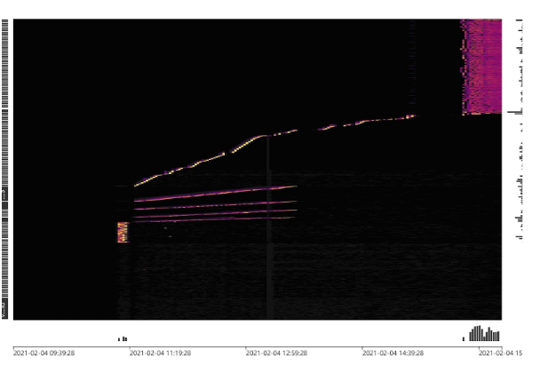

# 第13　ホットスポットの軽減

### 1. ホットスポットへの書き込み
   
ほとんどのスタンドアロン型RDBMSではB+treeデータ構造を採用しており、主キーはしばしばデータのキーインデックス構成に使用され（このとき、テーブルは索引構成表と呼ばれます）、同一データページ内のレコードは主キー順に格納されます。このため、スタンドアロン型RDBMS製品では通常、連続するシーケンス番号を書き込むことを推奨しています。この場合、新しいレコードを書き込むと、その時点のB+treeインデックスノードの後続位置に逐次追加され、データページが一杯になると自動的に次のページへの書き込みを始めます。逆に、あまりにランダムな主キー値は、新しいレコードがデータページの特定の中間位置に書き込まれることで、データ移動によるオーバーヘッドが増加することとなります。

TiDBはスタンドアロン型RDBMSとは異なるデータ構造を持っていますが、順序立った主キー値の書き込みは、TiDBにも次のような類似する効果をもたらします。TiKVのあるregionが一杯になると、新しいregionが分割され、その後は新しいreigonに書き込まれる。ただし、これにはメリットだけでなくデメリットもあります。スタンドアロン型RDBMSのベストプラクティスをTiDBに適用すると、書き込みストレスが1つのregionに集中します。ホットスポットに継続的に書き込まれると、TiDBのような分散型データベースの書き込み同時実行能力を発揮することができず、業務書き込みボトルネックが狭まり、システムリソースの浪費につながります。

TiDBに書き込みホットスポットが発生する主な原因には、次のようなものがあります。
- ミニテーブル、テーブル全体にregionが1つしかなく、同時実行リクエストが相次ぐと読み書きホットスポットが発生する。
- 大量書き込み時にキー値の離散の度合いが1つのregionサイズ（96MB）をスキップするのに不足し、書き込みホットスポットが発生する。

### 2. ホットスポットのモニタリングとポジショニング

TiDB v4.0から、クラスタ負荷を迅速に識別するためのダッシュボードキービジュアライザ（Key Visualizer）を提供しています。下図に書き込みホットスポットの表示効果を示しています。中央の明るい曲線が連続的に書き込まれたキー値のテーブルの存在を表します。右上の線は書き込みストレスが均一な負荷を表します。Key Visualizerの詳細な使用方法については、公式 [ドキュメント](https://docs.pingcap.com/tidb/stable/dashboard-key-visualizer) を参照してください。

*画像1 書き込みホットスポットのダッシュボードキービジュアライザでの表示効果*

### 3. 書き込みホットスポットの軽減

1. **SHARD_ROW_ID_BITS**パラメータ設定による書き込みホットスポットの分散

索引構成表以外（デフォルト動作）については、TiDBは暗黙の自動インクリメントROWIDを使用します。大量INSERT時にはデータが単一regionに集中的に書き込まれることで、書き込みホットスポットが発生します。**SHARD_ROW_ID_BITS**を設定することで、ROWIDが複数のregionに分散して書き込まれ、書き込みホットスポットを軽減できます。ただし、設定値が大きすぎるとRPCリクエスト数が増加し、CPUとネットワークのオーバーヘッドが増大します。

**SHARD_ROW_ID_BITS**を使用して隠し列**_tidb_ROWID**スライス数のビット数を設定します。デフォルト値は0（2^0=1スライス）です。**SHARD_ROW_ID_BITS=4**は16スライス、**SHARD_ROW_ID_BITS=6**は64スライス、**SHARD_ROW_ID_BITS=0**は1スライス（デフォルト値）をそれぞれ表します。

CREATE TABLE句の例: `CREATE TABLE t (c int) SHARD_ROW_ID_BITS = 4 PRE_SPLIT_REGIONS=4;`
ALTER TABLE句の例: `ALTER TABLE t SHARD_ROW_ID_BITS = 4 PRE_SPLIT_REGIONS=4;`

2. 連続自動インクリメント値を回避するための主キー設計

索引構成表は**SHARD_ROW_ID_BITS**の最適化に使用できず、シーケンス番号の変更によって複数の書き込みスライスを構成することで、書き込みホットスポットを分散します。

**AUTO_INCREMENT** 主キーは**AUTO_RANDOM**メカニズムによって書き込みホットスポットを分散します。詳細は公式ウェブサイト[ドキュメント](https://docs.pingcap.com/tidb/v4.0/troubleshoot-hot-spot-issues) を参照してください。下表の左側はもともとテーブルに書き込もうとしていたシーケンス番号値、右側は変換後のシーケンス番号です。変換後のシーケンス番号は連続しておらず、離散の度合いが1つのregionサイズをスキップするのに十分となっています。これにより書き込みホットスポットを分散します。

| 元のシーケンス番号 | 変換後のシーケンス番号 |
|--------------------|------------------------|
| 56163237172451737**6** | 5**6**6163237172451737     |
| 56163237172871168**0** | 5**0**6163237172871168     |
| 56163237172871168**1** | 5**1**6163237172871168     |
| 56163237172871168**2** | 5**2**6163237172871168     |
| 56163237173290598**4** | 5**4**6163237173290598     |
| 56163237173290598**5** | 5**5**6163237173290598     |
| 56163237173290598**6** | 5**6**6163237173290598     |
| 56163237173290598**7** | 5**7**6163237173290598     |
| 56163237173290598**8** | 5**8**6163237173290598     |
| 56163237173710028**8** | 5**8**6163237173710028     |
*表1 連続した書き込みの10スライス書き込みへの変換例*

3. パーティションテーブル

[パーティションテーブル](https://docs.pingcap.com/tidb/stable/partitioned-table) （partitioned table）は1つのテーブルのデータを複数の物理表に分散します。複数の物理表のデータは複数のregionに分散されるため、パーティション規則に適切に従うことで、書き込みホットスポットを回避できます。

### 4. ホットスポットの読み取り

上記の**SHARD_ROW_ID_BITS**によりデータをregionに分散したとしても、ミニテーブルのホットスポットは依然として存在します。代表的なのは、頻繁に読み取られるパラメータ設定テーブルです。同時実行読み取りが1つかいくつかのregionに集中し、トランザクション全体のパフォーマンスボトルネックとなることがあります。

これに対しては、アプリケーションサイドで**redis**などの製品を使用してキャッシュ処理を行うことを推奨します。
