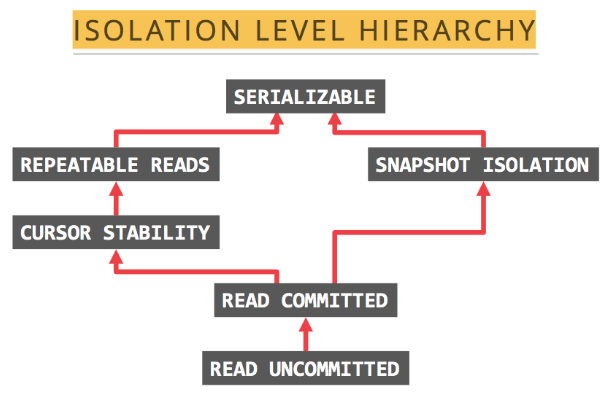

# 第6　トランザクション制限

### 1. 分離レベル
TiDBがサポートする分離レベルはRC（Read Committed）とSI（Snapshot Isolation）です。このうちのSIの分離レベルは基本的にRR（Repeatable Read）と同等です。


### 2. SIはファントムリードを解消可能
TiDBのSI分離レベルは、ファントムリード（Phantom Reads）を解消できます。ただし、ANSI/ISO SQL規格のRRは解消できません。

- ファントムリード：トランザクションAがまず条件に従ってnつのレコードを抽出すると、トランザクションBがそのnつのレコード以外のmつのレコードを変更するか、mつのトランザクションAクエリ条件に適合するレコードを追加することで、トランザクションAの次回リクエスト送信時にn+mつの条件適合レコードが確認され、ファントムリードが発生する。

例: システム管理者Aはデータベースに記録された全学生の成績を点数から等級A、B、C、D、Eに変更したが、システム管理者Bがこのとき点数のレコードを追加していたため、システム管理者Aが変更後にまだ変更されていないレコードが1つあることで、幻覚が生じたように感じる。これをファントムリードという。

### 3. SIはライトスキューを解消不可
TiDBのSI分離レベルは、ライトスキュー（Write Skew）を解消できます。ライトスキューを解消するには、SELECT FOR UPDATE構文を使用する必要があります。

- ライトスキュー：同時実行可能な2つのトランザクションが異なるが関連するレコードを読み取り、その2つのトランザクションがそれぞれ読み取ったデータを更新し、最後にトランザクションを送信し、これらの関連するレコード間に複数のトランザクションによって同時変更できないという制約がある場合、制約に反したこととなる。

    | 氏名 | 当直ステータス |
    |------|----------------|
    | 佐藤 |        0       |
    | 鈴木 |        0       |
    | 田中 |        0       |

このようなトランザクションがある場合、ロジックは現在誰も当直がいないと判断し、当直を1人設定します。このプログラムの逐次実行時には、当直を1名のみ設定します。ただし、同時実行時には、複数名が同時に当直ステータスにあるというエラーが発生することがあります。このエラーを引き起こす原因がライトスキューです。

### 4. SAVEPOINTはサポート外
TiDBは、SAVEPOINTメカニズムをサポートしていません。このため、PROPAGATION_NESTED伝搬動作もサポートしていません。Java Springスキームのアプリケーションは、PROPAGATION_NESTED伝搬動作を使用した場合、アプリケーションサイドで調整する必要があります。

次のような操作を実行しようとした場合、SAVEPOINTコマンド実行時にエラーとなります。
```
mysql> BEGIN;
mysql> INSERT INTO T2 VALUES(100);
mysql> SAVEPOINT svp1;
mysql> INSERT INTO T2 VALUES(200); 
mysql> ROLLBACK TO SAVEPOINT svp1; 
mysql> RELEASE SAVEPOINT svp1;
mysql> COMMIT;
mysql> SELECT * FROM T2;
+------+
| ID  |
+------+
| 100 |
+------+
```

### 5. 大規模トランザクション制限
ログベースのデータベースでは、大規模トランザクションが発生した場合、ログが単一トランザクションで一杯にならないよう、使用可能なログ容量を手動で拡張する必要があります。

TiDBの大規模トランザクション処理パフォーマンスは、並行に実行される小規模なトランザクションパフォーマンスに比べて劣るため、TiDBはトランザクション量に制限を設けています。

- 1行最大レコード容量が120MB（TiDB v5.0以降のバージョンはtidb-server設定項目performance.txn-entry-size-limitで調整可能。TiDB v5.0以前のバージョンの1行レコード容量は6MB）。
- サポートする最大単一トランザクション1行最大レコード容量が10GB（TiDB v4.0以降のバージョンはtidb-server設定項目performance.txn-total-size-limitで調整可能）。
